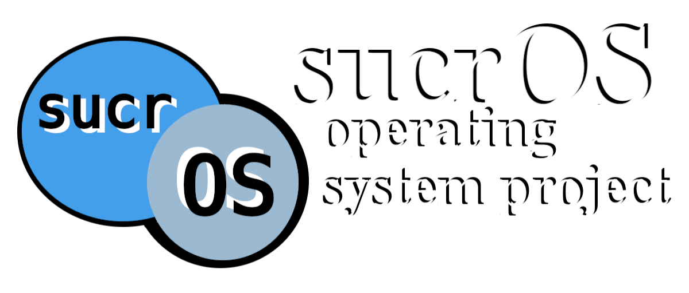

## Introduction
SucrOS (/ˈsukɹoʊs/) is an operating system project I am making for fun. The goal
is to create a multitasking kernel capable of running simple programs. The only
real part of sucrOS is the kernel, however this repo will also contain several
small programs (`programs/`) and a basic shell (`shell/`) for the purposes of
demonstrating kernel functionality.
